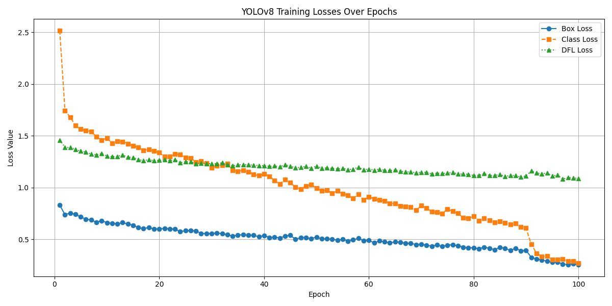

# Nine-Gaze Based Automated Strabismus Detection Using YOLOv8

## Overview

This project presents an automated deep learning system for strabismus detection and classification using a **9-gaze ocular imaging protocol**. The system leverages the **YOLOv8 object detection framework** to classify eye alignment conditions across multiple gaze directions.

The model performs:
- Binary classification: Strabismus vs Normal
- Multi-class classification: Esotropia, Exotropia, Hypertropia, Hypotropia, Normal

A total of **45 fine-grained gaze-specific classes** were used during training, later aggregated for clinical interpretability.

---

## Dataset

- Source: Publicly available ophthalmic 9-gaze dataset
- Total original images: **927**
- After augmentation: **2,775 images**
- Classes:
  - 5 clinical categories
  - 9 gaze directions
  - 45 fine-grained combinations

### Annotation
- Annotated using Roboflow
- Expert ophthalmologist labeling based on APCT (Alternate Prism Cover Test)
- Export format: YOLO

---

## Data Augmentation

To improve generalization:
- Horizontal flipping
- Rotation
- Brightness variation

This increased dataset diversity and reduced overfitting risk.

---

## Model

- Architecture: YOLOv8 (Ultralytics v8.3.75)
- Variant: YOLOv8n
- Image size: 640 × 640
- Optimizer: Adam (lr = 0.001)
- Hardware: Tesla T4 GPU
- Split:
  - Train: 70–80%
  - Validation: 20%
  - Test: 10%

---

## Results

### Binary Classification (Strabismus vs Normal)

| Class        | Instances | Precision | Recall | mAP50 | mAP50-95 |
|-------------|----------|-----------|--------|--------|----------|
| Strabismus  | 133      | 0.444     | 0.598  | 0.549  | 0.425    |
| Normal      | 411      | 0.662     | 0.839  | 0.755  | 0.601    |

---

### Multi-Class Classification (5 Classes)

| Category | Instances | Precision | Recall | mAP50 | mAP50-95 |
|----------|----------|-----------|--------|--------|----------|
| Eso      | 54       | 0.403     | 0.590  | 0.510  | 0.377    |
| Exo      | 49       | 0.385     | 0.698  | 0.543  | 0.427    |
| Hyper    | 8        | 0.869     | 0.250  | 0.733  | 0.600    |
| Hypo     | 28       | 0.506     | 0.536  | 0.583  | 0.465    |
| Normal   | 411      | 0.662     | 0.839  | 0.755  | 0.601    |

---

## Key Findings

- Binary classification accuracy: **~61.9%**
- Best-performing class:
  - Hypotropia Right (mAP50-95 = 84.6%)
- Lowest-performing class:
  - Exo Straight Down (mAP50-95 = 15.8%)
- Strong performance in:
  - Normal class detection (high recall = 0.839)

---

## Confusion Matrices

### Multi-class

### Binary

---

## Training Performance

---

## Discussion

The YOLOv8-based system demonstrates strong real-time performance for strabismus detection. However, performance varies across classes due to:

- Dataset imbalance
- Limited samples in minority classes (e.g., Hyper, Hypo)
- Sensitivity to lighting conditions

Despite these limitations, YOLOv8 provides significant advantages in:
- Speed
- Real-time inference
- Spatial accuracy

---

## Limitations

- Class imbalance across 45 gaze-specific labels
- Sensitivity to illumination variations
- Lower recall in minority classes

---

## Future Work

- Expand dataset across demographics and lighting conditions
- Improve class balancing strategies
- Explore transformer-based hybrid architectures
- Domain adaptation for clinical deployment
- Synthetic data generation for rare classes

---

## Conclusion

This work demonstrates that YOLOv8 combined with a 9-gaze imaging protocol can effectively support automated strabismus screening. The system shows promise for real-time clinical and telemedicine applications.

---

## Disclaimer

This system is intended for research purposes only and is not a substitute for professional medical diagnosis.
